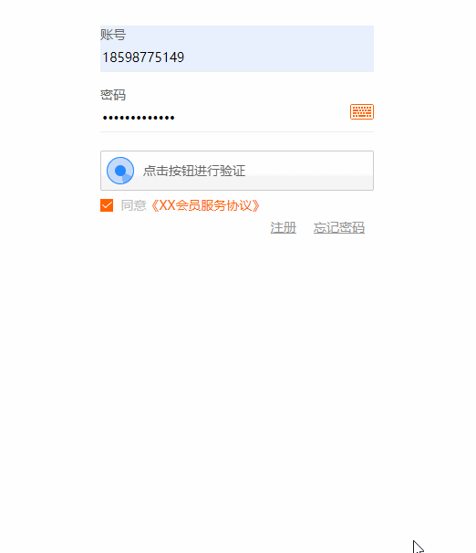
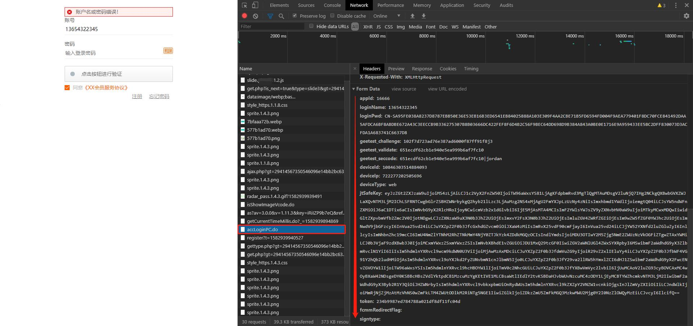
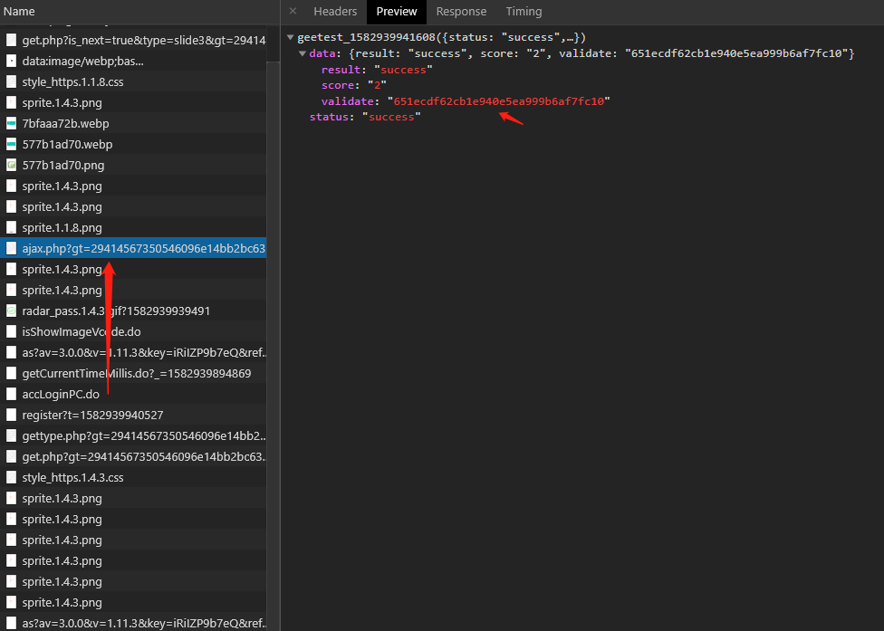
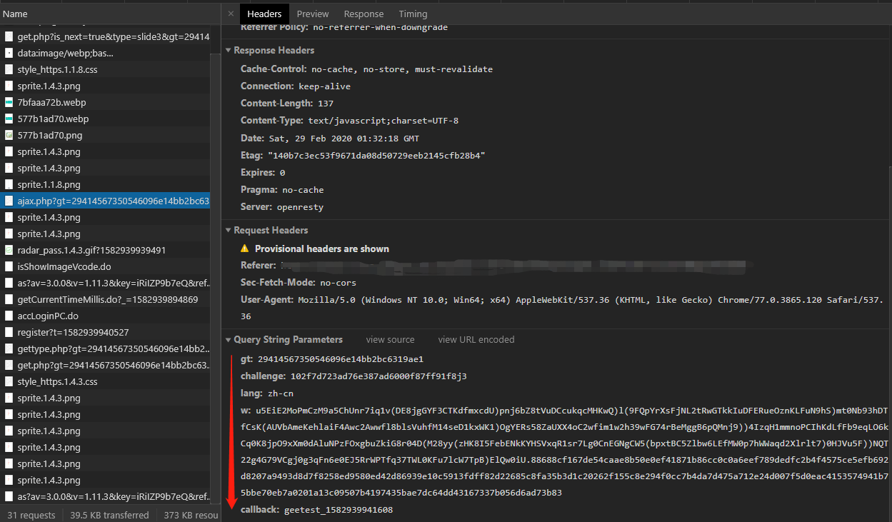
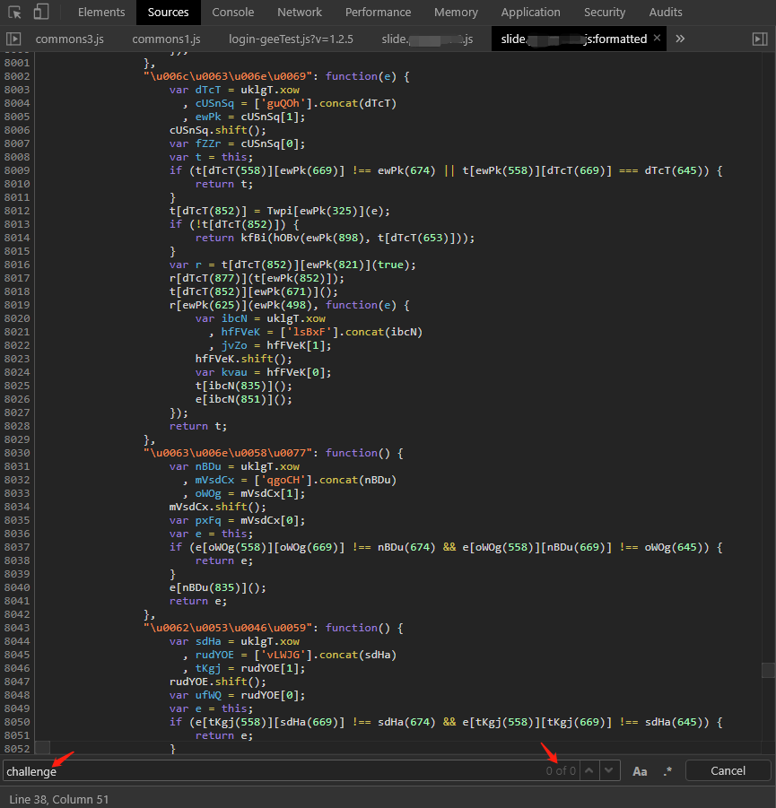
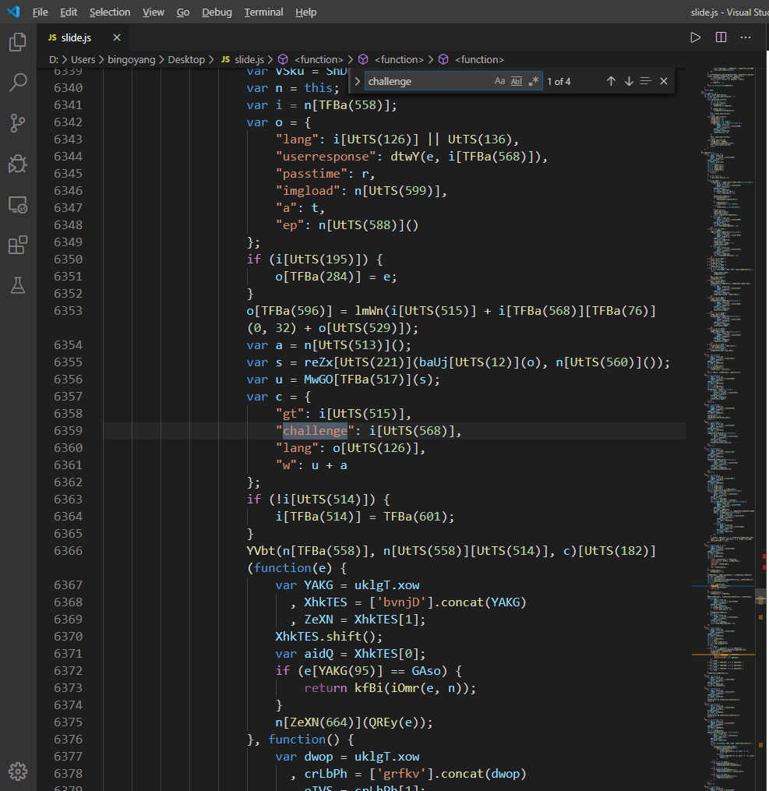
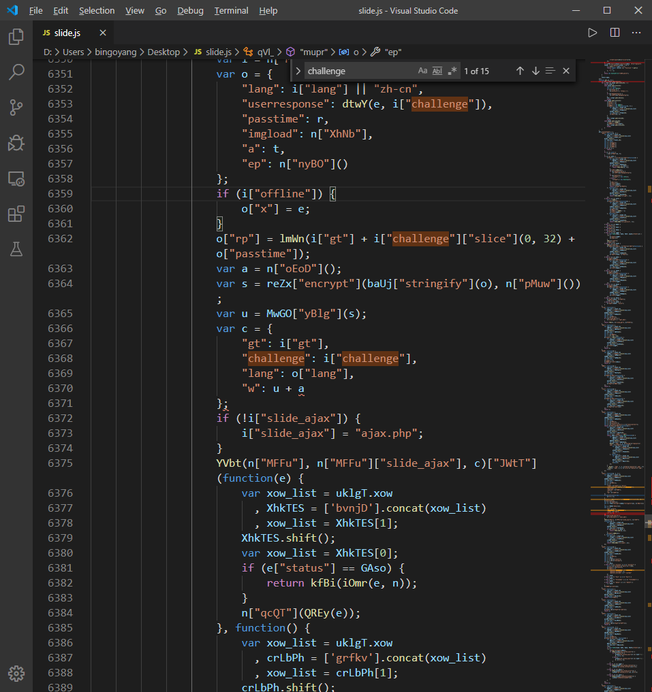
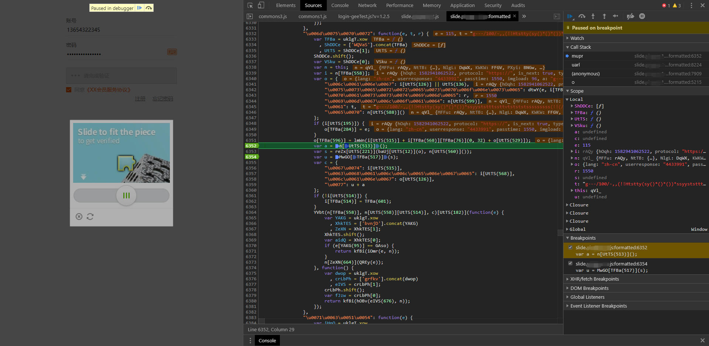
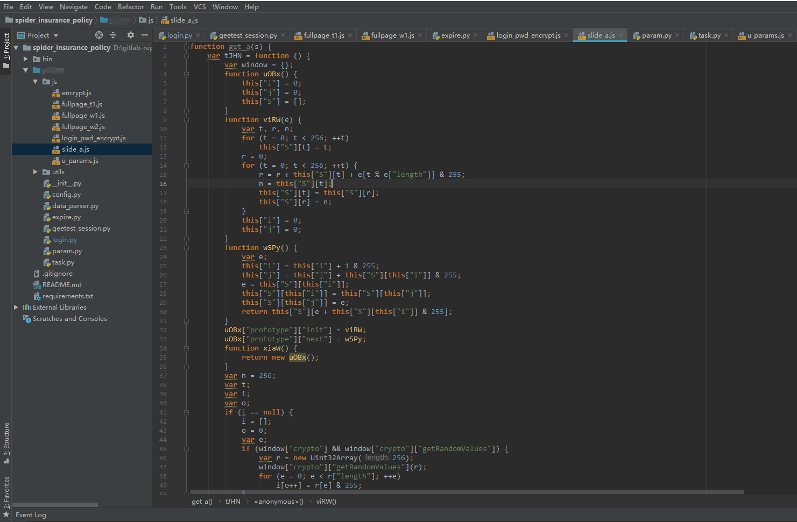

# 极验验证码破解

无须使用 Selenium、Webdriver 等，直接通过解密 JavaScript 参数破解。

温馨提醒，运行代码前，请：

- 安装 [requirements.txt](./requirements.txt) 中的库；
- 安装 Node 环境、Redis 数据库。

## 什么是“极验”？

或许你没听说过[极验](https://www.geetest.com/)，但你很大可能使用过极验的产品。极验是首家「行为式验证」​ 安全技术服务提供商，并以提供验证码服务而闻名。我们日常会登录一些网站，有的网站登录前需要校验验证码，而这个验证码服务很可能就是极验提供的。

## 示例官网

我以“[XX](https://httpbin.org/get?code=0&msg=Sorry,%20the%20real%20url%20has%20been%20hidden&author=bingo)”官网为例，来说明如何破解极验验证码。



## 破解思路

目前，对于这一类的滑动验证码，业界里常见的一个破解方法就是**计算缺口位置，使用 Selenium 自动化测试工具，模拟人类手动拖动滑块的过程**。这种方法实现较为简单，但存在着两个缺点：一是模拟滑动，容易被极验检测到我们使用的是自动化软件，从而导致滑动操作失败；二是每一次登录任务都需要驱动浏览器，登录耗时较长，这对于实时性要求较高的数据采集任务来说，几乎是不可接受的。

所以，我决定走一条比较艰难的道路：**死磕 JavaScript 代码，破解每个请求中的加密参数，之后在程序中发送请求得到正确响应。** 这是最直接且最高效的方式，它无需等待浏览器对页面进行渲染，只要解出加密的请求参数，发送请求获取响应即可。

> 我们必须知道的一个事实是，用户在浏览器中的操作，如点击验证码、拖动滑块等动作，最终都会转化为请求发送到服务端，服务端对请求参数进行合法性校验，并响应结果。

之所以说比较艰难，一是因为我并非从事前端开发工作，对于 JavaScript 代码的调用栈分析不如前端同学熟练；二是因为极验的 JavaScript 代码实在混淆得特别难懂，如何从上万行混淆的 JavaScript 代码中抽离出关键的加密代码，也是一项很大的挑战。可以毫无夸张地说，没有足够的毅力和耐心，很难实现破解。

## 动手破解

接下来我会大致描述整个破解流程，对于过于细节化的东西，就不在这里赘述了。

### 1. 请求参数分析

我以最终的登录方法作为分析入口。输入一个错误的账号密码，然后点击滑动并拖动到正确的位置。此后页面会提示“**账户名或密码错误！**”。观察浏览器 Network 栏，其实登录这个动作是发出了 Name 为 accLoginPC.do 这个请求。



请求的 URL 是：https://xxx.xxx/webapi/accLoginPC.do （已脱敏）。

请求参数 Form Data 有多个，包括：`appId`、`loginName`、`loginPwd`、`geetest_challenge` 等。可以看到，密码被加密成 `CN-S513...` 这一长段，另外还有三个以 `geetest_` 开头的加密参数，分别是：

- geetest_challenge: 102f7d723ad76e387ad6000f87ff91f8j3
- geetest_validate: 651ecdf62cb1e940e5ea999b6af7fc10
- geetest_seccode: 651ecdf62cb1e940e5ea999b6af7fc10|jordan

从参数命名上，我们能够很清晰地看出，这是极验滑动验证码的加密参数。也即是说，**我们点击验证码，拖动滑块这些动作，最终转换为这三个加密参数**。我们的主要工作，也在于破解这三个参数。细心的同学可能发现了，其中 `geetest_validate` 与 `geetest_seccode` 参数基本相同，只不过 `geetest_seccode` 多了 `|jordan` 的字符串后缀。那么，最主要的工作就是解出 challenge/validate 两个参数。

> 对于其他非极验加密参数，如 `loginPwd`、`jtSafeKey`、`token` 等，均属于 XX 官网自身的加密逻辑，破解难度不大，因此，文章里，我们主要聚焦于极验参数的破解。

我们再往上找，发现了 `ajax.php?` 这个请求，这个请求里的响应信息是一个类似 json 串的东西，里面包着 validate 参数。震惊，这不就是我们前文的 `geetest_validate` 参数吗？



观察其请求参数，发现是 gt、challenge、lang、w 和 callback。其中 w 加密成了一长串。



如此分析，我们逐渐捋清思路，得知每一个请求都需要解出哪些加密参数，我就不在这里花费大量篇幅做细致描述了。

之后针对这些参数名，查看 JavaScript 代码中是如何加密的，一步步...

### 2. 代码反混淆

我们点击 `slide.xxx.js` 文件，跳转到 Chrome Sources 菜单栏，查看 JavaScript 代码。

想查看 JavaScript 代码对请求参数的加密逻辑可没那么容易，极验做了大量的混淆工作，为的是提高我们的破解难度。



可以看到，代码基本不是我们凡人所能看懂的。它对代码进行了 Unicode 编码，并且加上了大量的混淆代码。这导致我们直接搜 `challenge` 这些关键参数名，是找不到相关代码的。

那么，我们首先将完整的 JavaScript 代码 copy 出来，先到网上找一个 Unicode 编码还原工具，对代码进行 Unicode 解码。解码之后，复制到编辑器中，搜索 `challenge`，发现了几个关键的参数。



此时的代码依然难以阅读，因为极验对每个关键参数都进行了混淆，混淆的逻辑就是使用类似这种 `UtTS` 的代码进行替换，逻辑也藏在 JavaScript 代码中，具体就不展开了。我们对其进一步还原。还原之后，代码如下：



明显感觉到代码清晰了不少，还有一个问题是：怎么还有很多这种 `var xow_list = uklgT.xow` 莫名其妙的代码。我们研究发现，这其实是极验加入的冗余代码，主要目的是为了混淆视听。

比如，对于这样的冗余代码：

```javascript
function tPcX(e) {
  var SkB = uklgT.yaA()[0][22];
  for (; SkB !== uklgT.yaA()[16][19]; ) {
    switch (SkB) {
      case uklgT.yaA()[0][22]:
        var t = this;
        var r = e["DxJq"];
        SkB = uklgT.yaA()[0][21];
        break;
      case uklgT.yaA()[16][21]:
        r["height"] = r["width"] = 0;
        t["vjyG"] = r["getContext"]("2d");
        SkB = uklgT.yaA()[4][20];
        break;
      case uklgT.yaA()[4][20]:
        t["wOTb"] = t["xmDd"] = t["yZRm"] = t["AZ_O"] = 0;
        t["BnKG"] = r;
        SkB = uklgT.yaA()[4][19];
        break;
    }
  }
}
```

我们还原之后，就变成了以下精简且易读的代码：

```javascript
function tPcX(e) {
  var t = this;
  var r = e["DxJq"];
  r["height"] = r["width"] = 0;
  t["vjyG"] = r["getContext"]("2d");
  t["wOTb"] = t["xmDd"] = t["yZRm"] = t["AZ_O"] = 0;
  t["BnKG"] = r;
}
```

通过对多个 JavaScript 文件，如 slide.js/fullpage.js 等进行反混淆，我们对 JavaScript 的调用逻辑清晰了很多。

### 3. 代码解绑定

完成了代码反混淆，还有一个重要的工作，就是如何从 JavaScript 代码中抽离出关键的 JavaScript 代码，这些代码就是请求参数的加密逻辑。我将此过程称为“代码解绑定”。

这个过程并不需要什么技巧，需要的只是耐心，耐心，耐心。跟着 Chrome 浏览器，打断点分析请求的入口与出口，一步步将关键代码剥离出来。



比如，我们需要解出参数 a，那么就抽离出加密参数 a 的代码，封装成一个 `get_a()` 的函数。



封装了几个需要的 JavaScript 函数，我们可以在 Python 程序中，使用 PyExecJS 库，方便地执行 JavaScript 代码拿到加密参数。以下为一些示例代码：

```python
def get_js_object(js_file_path):
    """获取js可执行对象"""
    with open(os.path.dirname(__file__) + js_file_path, encoding='GBK') as f:
        js_file = f.read()
        return execjs.compile(js_file)


pwd_encrypt_js = get_js_object(pwd_encrypt_js_path)
full_page_t1_js = get_js_object(full_page_t1_js_path)
full_page_w1_js = get_js_object(full_page_w1_js_path)
full_page_w2_js = get_js_object(full_page_w2_js_path)
u_js = get_js_object(u_js_path)
slide_u_js = get_js_object(slide_u_js_path)
slide_a_js = get_js_object(slide_a_js_path)


def get_encrypt_pwd(pwd):
    """获取加密后的密码"""
    return pwd_encrypt_js.call('pwdEncrypt', pwd)


def get_full_page_t1(s):
    """获取fullpage的t1参数"""
    return full_page_t1_js.call('get_t', s)


def get_full_page_w1(gt, challenge, s):
    """获取fullpage的w1参数"""
    t = get_full_page_t1(s)
    return full_page_w1_js.call('get_w', gt, challenge, s, t)


def get_full_page_w2(gt, challenge, s):
    """获取fullpage的w2参数"""
    return full_page_w2_js.call('get_w', gt, challenge, s)


def get_slide_w(gt, challenge, s, offset, track):
    """获取slide的w参数"""
    u = {
        'lang': 'zh-cn',
        'userresponse': u_js.call('getUserResponse', offset - 1, challenge),
        'passtime': track[-1][-1],
        'imgload': random.randint(110, 180),
        'a': u_js.call("mouse_encrypt", track),
        'ep': {"v": "1.2", "f": u_js.call("lmWn", gt + challenge)},
        'rp': u_js.call("lmWn", gt + challenge[0:32] + str(track[-1][-1]))
    }
    u = slide_u_js.call('_encrypt', u, s)
    a = slide_a_js.call('get_a', s)
    return u + a
```

### 4. 滑动轨迹采集

代码解绑定之后，还没完，你可以看到，上面的 `get_slide_w()` 函数中，有偏移量 offset 和 track 轨迹。需要我们要拿到验证码带缺口和不带缺口的图片，对比像素之后才能计算出 offset。

而对于验证码，还需要做些处理，因为我们通过 URL 拿到的两张验证码图片，都是被打乱的。需要根据极验的 JavaScript 代码，对两张打乱的图片进行还原。具体的还原逻辑就不在此赘述了。


而对于滑动轨迹，若使用自动化工具模拟人类拖动滑块，容易被识别为机器行为而导致滑动失败。本项目里，我们采用人为手动拖动验证码的方式（人为拖动，是正常的行为），收集一批轨迹，构成轨迹库。之后，只要算出滑动验证码缺口的偏移量，从轨迹库中找到与偏移量相近的轨迹即可。虽然有一定的错误率，比如，轨迹库不够丰富而导致取不到偏移量对应的轨迹，但是我们可以在接下来的程序里，采用一种**特殊的方式**对其进行优化，可以保证每次登录 100% 成功。

### 5. 小结

以上便是整个极验破解的过程，再简单总结一下：

1. 请求参数分析
2. 代码反混淆
3. 代码解绑定
4. 滑动轨迹采集

其中，还包括验证码图片的还原，图片缺口的计算等等。

## 特殊的优化方式是什么？

上文还提到一种特殊的优化方式，其实就是**极验 Session 验证码池的设计**。我们通过测试发现，并非需要在每个登录任务来的时候，再去解密参数，进而滑动验证码。我们其实可以预先滑动好验证码（其实就是发请求），然后把得到成功响应的 Session 存起来，放在一个池子中。这样做的好处主要有 2 点：

1. 提高登录效率，缩减耗时；
2. 提高数据采集程序的健壮性。

当有登录任务过来的时候，我们从池子中取出一个极验 Session，加上登录任务中的用户名/密码(按照 XX 官网，密码还需做加密)直接去登录，是不是既简单又高效呢？

验证码池子的设计就很重要了，考虑一个问题：验证码池子如何实现自动更新与过期删除？之所以要考虑这个问题，是因为滑动验证码并非长期有效，已经无效的验证码不应该堆积在池子上，否则会极大地浪费存储空间。我们希望实现的效果是：

- 每一次都从池子中拿出最新请求到的一个验证码（这样可以 100% 保证验证码有效）；
- 可以定期清除池子中一批比较旧的验证码。

基于以上分析，我采用 Redis Sorted Sets （以下简称 zset）这种数据类型来存储极验 Session。zset 是一个有序的集合，在请求到验证码并存储到池子的时候，可以使用当前时间戳作为元素的 score，zset 会根据 score 对插入元素进行排序。好处就是：我们可以方便地使用 `zrevrange` 命令获取到最新的一个验证码 session，同时我们又可以使用 `zremrangebyscore` 移除某个时间范围内的验证码，从而达到自动过期删除的目的。

代码见 [geetest_session.py](/geetest_crack/geetest_session.py)

运行日志如下：

```
2020-04-01 15:38:57 geetest_session.py [line:116] INFO: 滑动验证码图片,bg_url:https://captcha-static.pingan.com/pictures/gt/1e6ca4d3f/bg/0acfd4d64.jpg, full_bg_url:https://captcha-static.pingan.com/pictures/gt/1e6ca4d3f/1e6ca4d3f.jpg
2020-04-01 15:39:00 geetest_session.py [line:154] INFO: 获取极验session结果：Resp.SUCCESS
2020-04-01 15:39:00 geetest_session.py [line:154] INFO: 获取极验session结果：Resp.SUCCESS
2020-04-01 15:39:01 geetest_session.py [line:154] INFO: 获取极验session结果：Resp.SUCCESS
2020-04-01 15:39:01 geetest_session.py [line:46] INFO: gt/challenge请求结果：{'challenge': '49bf36f101312f382b66670af7a6061f', 'gt': '29414567350546096e14bb2bc6319ae1', 'success': 1}
2020-04-01 15:39:03 geetest_session.py [line:116] INFO: 滑动验证码图片,bg_url:https://captcha-static.pingan.com/pictures/gt/61ffa98e8/bg/8627cc65f.jpg, full_bg_url:https://captcha-static.pingan.com/pictures/gt/61ffa98e8/61ffa98e8.jpg
2020-04-01 15:39:04 geetest_session.py [line:46] INFO: gt/challenge请求结果：{'challenge': '2241ffcb990425fd1f4d93a06dd1ffb1', 'gt': '29414567350546096e14bb2bc6319ae1', 'success': 1}
2020-04-01 15:39:05 geetest_session.py [line:46] INFO: gt/challenge请求结果：{'challenge': '8f6168ebdfd8561d6f14d2d8973dcaa3', 'gt': '29414567350546096e14bb2bc6319ae1', 'success': 1}
2020-04-01 15:39:05 geetest_session.py [line:46] INFO: gt/challenge请求结果：{'challenge': '9926b4297f6ed6df614e68dafafa58e6', 'gt': '29414567350546096e14bb2bc6319ae1', 'success': 1}
2020-04-01 15:39:06 geetest_session.py [line:116] INFO: 滑动验证码图片,bg_url:https://captcha-static.pingan.com/pictures/gt/d49a453dc/bg/fc62c5927.jpg, full_bg_url:https://captcha-static.pingan.com/pictures/gt/d49a453dc/d49a453dc.jpg
2020-04-01 15:39:06 geetest_session.py [line:154] INFO: 获取极验session结果：Resp.SUCCESS
2020-04-01 15:39:06 geetest_session.py [line:116] INFO: 滑动验证码图片,bg_url:https://captcha-static.pingan.com/pictures/gt/cac640dea/bg/ec34f0e13.jpg, full_bg_url:https://captcha-static.pingan.com/pictures/gt/cac640dea/cac640dea.jpg
2020-04-01 15:39:06 geetest_session.py [line:116] INFO: 滑动验证码图片,bg_url:https://captcha-static.pingan.com/pictures/gt/ebc5e54b4/bg/ca96d4224.jpg, full_bg_url:https://captcha-static.pingan.com/pictures/gt/ebc5e54b4/ebc5e54b4.jpg
2020-04-01 15:39:11 geetest_session.py [line:154] INFO: 获取极验session结果：Resp.SUCCESS
2020-04-01 15:39:11 geetest_session.py [line:154] INFO: 获取极验session结果：Resp.SUCCESS
2020-04-01 15:39:11 geetest_session.py [line:46] INFO: gt/challenge请求结果：{'challenge': '61556a44d32a9786b61ab8afbea3989b', 'gt': '29414567350546096e14bb2bc6319ae1', 'success': 1}
2020-04-01 15:39:11 geetest_session.py [line:154] INFO: 获取极验session结果：Resp.SUCCESS
2020-04-01 15:39:12 geetest_session.py [line:116] INFO: 滑动验证码图片,bg_url:https://captcha-static.pingan.com/pictures/gt/cd0bbb6fe/bg/2f991caf7.jpg, full_bg_url:https://captcha-static.pingan.com/pictures/gt/cd0bbb6fe/cd0bbb6fe.jpg
2020-04-01 15:39:15 geetest_session.py [line:46] INFO: gt/challenge请求结果：{'challenge': '0df340035700753080348c13eadacbd4', 'gt': '29414567350546096e14bb2bc6319ae1', 'success': 1}
2020-04-01 15:39:15 geetest_session.py [line:154] INFO: 获取极验session结果：Resp.SUCCESS
2020-04-01 15:39:15 geetest_session.py [line:46] INFO: gt/challenge请求结果：{'challenge': '5c192a8d548da735c393fce93df17b00', 'gt': '29414567350546096e14bb2bc6319ae1', 'success': 1}
2020-04-01 15:39:15 geetest_session.py [line:46] INFO: gt/challenge请求结果：{'challenge': '9389c0cefacfca69e39ab2aee20b4fda', 'gt': '29414567350546096e14bb2bc6319ae1', 'success': 1}
2020-04-01 15:39:17 geetest_session.py [line:116] INFO: 滑动验证码图片,bg_url:https://captcha-static.pingan.com/pictures/gt/1e6ca4d3f/bg/2a98c1588.jpg, full_bg_url:https://captcha-static.pingan.com/pictures/gt/1e6ca4d3f/1e6ca4d3f.jpg
2020-04-01 15:39:17 geetest_session.py [line:116] INFO: 滑动验证码图片,bg_url:https://captcha-static.pingan.com/pictures/gt/1e6ca4d3f/bg/5283e2318.jpg, full_bg_url:https://captcha-static.pingan.com/pictures/gt/1e6ca4d3f/1e6ca4d3f.jpg
2020-04-01 15:39:17 geetest_session.py [line:116] INFO: 滑动验证码图片,bg_url:https://captcha-static.pingan.com/pictures/gt/9264fff13/bg/2e0bb3330.jpg, full_bg_url:https://captcha-static.pingan.com/pictures/gt/9264fff13/9264fff13.jpg
2020-04-01 15:39:20 geetest_session.py [line:46] INFO: gt/challenge请求结果：{'challenge': '9e532863e31fc59138438fba5d19b6ea', 'gt': '29414567350546096e14bb2bc6319ae1', 'success': 1}
2020-04-01 15:39:21 geetest_session.py [line:154] INFO: 获取极验session结果：Resp.SUCCESS
2020-04-01 15:39:22 geetest_session.py [line:154] INFO: 获取极验session结果：Resp.SUCCESS
2020-04-01 15:39:22 geetest_session.py [line:154] INFO: 获取极验session结果：Resp.SUCCESS
2020-04-01 15:39:22 geetest_session.py [line:116] INFO: 滑动验证码图片,bg_url:https://captcha-static.pingan.com/pictures/gt/1e6ca4d3f/bg/b0dbbc9c5.jpg, full_bg_url:https://captcha-static.pingan.com/pictures/gt/1e6ca4d3f/1e6ca4d3f.jpg
2020-04-01 15:39:25 geetest_session.py [line:154] INFO: 获取极验session结果：Resp.SUCCESS
2020-04-01 15:39:26 geetest_session.py [line:46] INFO: gt/challenge请求结果：{'challenge': '2e5da172682aade75ac8482b74a7a074', 'gt': '29414567350546096e14bb2bc6319ae1', 'success': 1}
2020-04-01 15:39:26 geetest_session.py [line:46] INFO: gt/challenge请求结果：{'challenge': '280aaee468f6e344c72e2e4408062405', 'gt': '29414567350546096e14bb2bc6319ae1', 'success': 1}
2020-04-01 15:39:27 geetest_session.py [line:46] INFO: gt/challenge请求结果：{'challenge': '9d5e8bfe23eeec059dd79d890c83d6d7', 'gt': '29414567350546096e14bb2bc6319ae1', 'success': 1}
2020-04-01 15:39:28 geetest_session.py [line:116] INFO: 滑动验证码图片,bg_url:https://captcha-static.pingan.com/pictures/gt/61ffa98e8/bg/285b1330f.jpg, full_bg_url:https://captcha-static.pingan.com/pictures/gt/61ffa98e8/61ffa98e8.jpg
2020-04-01 15:39:28 geetest_session.py [line:116] INFO: 滑动验证码图片,bg_url:https://captcha-static.pingan.com/pictures/gt/e840d69cc/bg/6c86e0ad3.jpg, full_bg_url:https://captcha-static.pingan.com/pictures/gt/e840d69cc/e840d69cc.jpg
2020-04-01 15:39:28 geetest_session.py [line:116] INFO: 滑动验证码图片,bg_url:https://captcha-static.pingan.com/pictures/gt/e44c02efd/bg/de65f3a21.jpg, full_bg_url:https://captcha-static.pingan.com/pictures/gt/e44c02efd/e44c02efd.jpg
2020-04-01 15:39:30 geetest_session.py [line:46] INFO: gt/challenge请求结果：{'challenge': 'd6062fc656baa01571ee5245831e4496', 'gt': '29414567350546096e14bb2bc6319ae1', 'success': 1}
2020-04-01 15:39:32 geetest_session.py [line:154] INFO: 获取极验session结果：Resp.TRACK_ERR
2020-04-01 15:39:32 geetest_session.py [line:167] ERROR: 获取极验session请求出错
2020-04-01 15:39:32 geetest_session.py [line:154] INFO: 获取极验session结果：Resp.SUCCESS
2020-04-01 15:39:32 geetest_session.py [line:116] INFO: 滑动验证码图片,bg_url:https://captcha-static.pingan.com/pictures/gt/1e6ca4d3f/bg/90861c73f.jpg, full_bg_url:https://captcha-static.pingan.com/pictures/gt/1e6ca4d3f/1e6ca4d3f.jpg
2020-04-01 15:39:33 geetest_session.py [line:154] INFO: 获取极验session结果：Resp.SUCCESS
2020-04-01 15:39:35 geetest_session.py [line:154] INFO: 获取极验session结果：Resp.SUCCESS
2020-04-01 15:39:36 geetest_session.py [line:46] INFO: gt/challenge请求结果：{'challenge': '0b0ac922cf5fe2d5b9060dd423dc4e23', 'gt': '29414567350546096e14bb2bc6319ae1', 'success': 1}
2020-04-01 15:39:36 geetest_session.py [line:46] INFO: gt/challenge请求结果：{'challenge': '9c2c6c18f9adbb8db92b3ecc644f2f9e', 'gt': '29414567350546096e14bb2bc6319ae1', 'success': 1}
2020-04-01 15:39:37 geetest_session.py [line:46] INFO: gt/challenge请求结果：{'challenge': 'ac1a20b54708caf252eb28a236da7ce8', 'gt': '29414567350546096e14bb2bc6319ae1', 'success': 1}
2020-04-01 15:39:38 geetest_session.py [line:116] INFO: 滑动验证码图片,bg_url:https://captcha-static.pingan.com/pictures/gt/cd0bbb6fe/bg/723c2109a.jpg, full_bg_url:https://captcha-static.pingan.com/pictures/gt/cd0bbb6fe/cd0bbb6fe.jpg
2020-04-01 15:39:39 geetest_session.py [line:116] INFO: 滑动验证码图片,bg_url:https://captcha-static.pingan.com/pictures/gt/e44c02efd/bg/f95abf82a.jpg, full_bg_url:https://captcha-static.pingan.com/pictures/gt/e44c02efd/e44c02efd.jpg
2020-04-01 15:39:39 geetest_session.py [line:116] INFO: 滑动验证码图片,bg_url:https://captcha-static.pingan.com/pictures/gt/9264fff13/bg/0e2c237a6.jpg, full_bg_url:https://captcha-static.pingan.com/pictures/gt/9264fff13/9264fff13.jpg
2020-04-01 15:39:40 geetest_session.py [line:46] INFO: gt/challenge请求结果：{'challenge': 'b0366c16750ccaef2366d07806e643ca', 'gt': '29414567350546096e14bb2bc6319ae1', 'success': 1}
2020-04-01 15:39:43 geetest_session.py [line:116] INFO: 滑动验证码图片,bg_url:https://captcha-static.pingan.com/pictures/gt/e840d69cc/bg/a310a9fa0.jpg, full_bg_url:https://captcha-static.pingan.com/pictures/gt/e840d69cc/e840d69cc.jpg
2020-04-01 15:39:43 geetest_session.py [line:154] INFO: 获取极验session结果：Resp.SUCCESS
2020-04-01 15:39:43 geetest_session.py [line:154] INFO: 获取极验session结果：Resp.SUCCESS
2020-04-01 15:39:44 geetest_session.py [line:154] INFO: 获取极验session结果：Resp.SUCCESS
2020-04-01 15:39:46 geetest_session.py [line:154] INFO: 获取极验session结果：Resp.SUCCESS
```

以上，全篇完！


## 声明

本项目仅供学习交流使用，请勿用于非法用途！